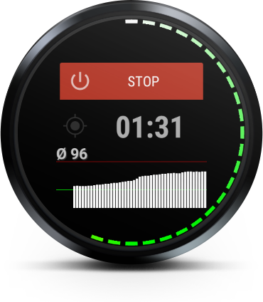
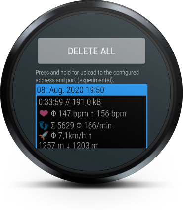
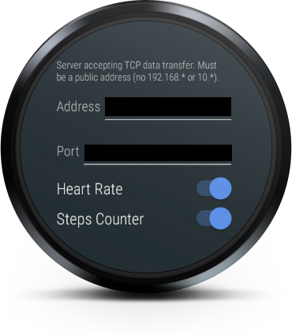

Tracker
=======

Tracker is an Android Wear (WearOS) app for recording sport activities, mostly jogging. Published under the  license.

Features
--------
- No cloud!
- Time measurement (pretty obvious :))
- Current heart rate graphically shown around the face
- History of last heart rate measurements shown as a bar graph
- Average heart rate shown numerically
- GNSS status shown as an icon
  - dark: no GNSS signal
  - magenta: one satellite (no position available)
  - red: two satellites (no position available)
  - yellow: three satellites (no position available)
  - white: three or more satellites, position available

- Data stored internally in the watch
- Possible to delete all files via the UI
- Possible to send a selected file via the UI to a raw TCP socket (anything better still in development)
- Details of each recording
  - Date/time of the beginning of the activity
  - Duration of the activity (h:mm:ss)
  - File size in kB
  - Average and maximum heart rate (bpm)
  - Total steps and average steps per minute
  - GNSS-based data: average speed, total ascent and total descent

- Configurable address and port for receiving files
  - Please note, private addresses (e.g. in your home network) will not work
- Toggle recording of: heart rate, steps, GNSS data, air pressure
- Toggle display always-on

Known issues
------------
- UI designed for round watches only
- File upload is as minimalistic as possible at the moment. You need a TCP-socket server available on a public IP in order to get the data. Give me some time to make it better.
- File upload works only with public IP addresses due to the routing limitations of the WearOS proxy. With enough time a companion app could solve it.
- GNSS (GPS, Glonass, Galileo, whatever your watch does support) is, at least on my device, very inaccurate, so the calculated speed, ascent and descent is mostly to make you laugh instead of any real value.
- Air pressure sensor, similarly, gives such a noise, that is it not worth recording its data. Maybe some filter would help - need to analyze it.
- GNSS always-on is still buggy in the implementation, that's why the switch is disabled per default.

To-do-List
----------
- Hide graphical heart rate in case no data received.
- Correct lifecycle management of the service in connection with the "GNSS always-on" function.
- Keep last activity time visible after display off/on cycle.
- Publish a .trk converter to .kml and .xlsx
- Make better file upload
- Offer constant data upload during the activity
- Analyze filters for air pressure sensor
- Nicer "delete all" confirmation dialog

TcpServer
=========
Essential TCP server for receiving data uploads from the app.
Usage:
- main class: de.miltschek.TcpServer
- start: no arguments, bind address and port are interactively configured
- stop: enter 'quit' at any time
- files are written to the current directory and named data_<CURRENT_TIMESTAMP>.bin
- limitation: single threaded

TrackerDesktop
==============
Essential file converter for the binary data files.
Usage:
- main class: de.miltschek.tracker.TrackerConverter
- start: no arguments or a single argument = path to the input file (.bin)
- if no arguments are provided, a file selection dialog opens asking for an input file
- output file: KML (name and location queried in the dialog)
- output file: CSV (name and location queried in the dialog)
- short summary is printed out in the console
- please note: the CSV file will be generated accordingly to the current formatting locale settings of the host; depending on the language version of your Excel, it expects either a dot or a comma as a decimal separator
